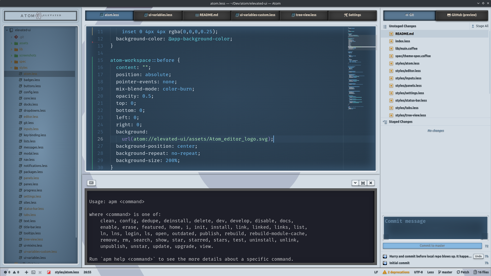
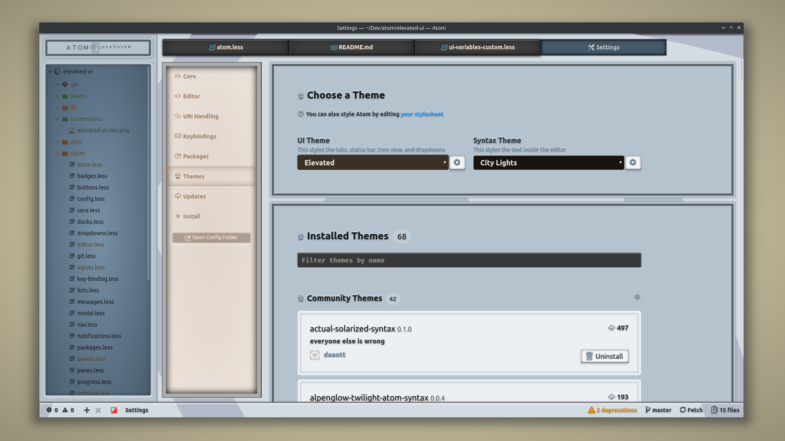
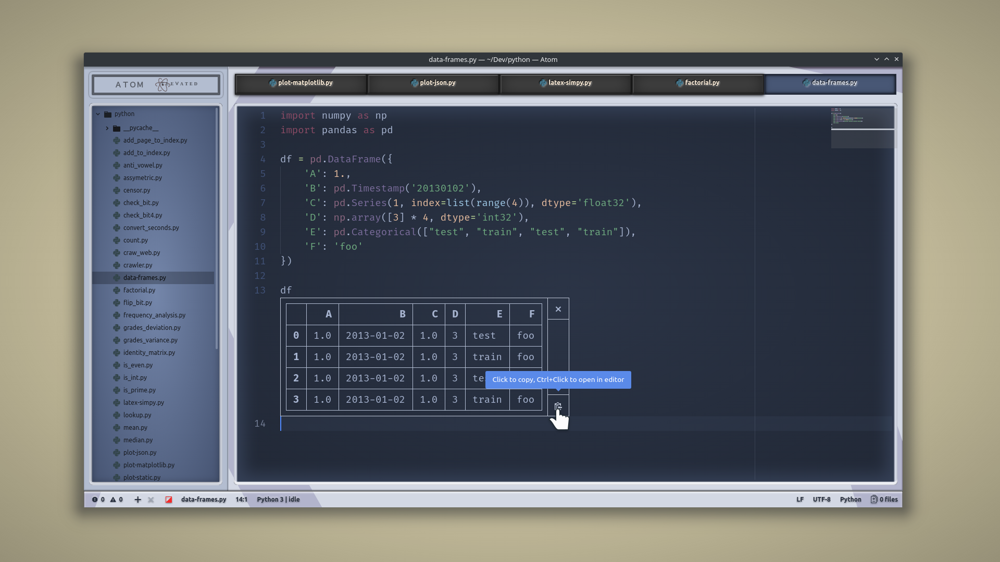

# Elevated UI

The non-flat UI for Atom. Elevated is a mostly light colored UI modelled after hardware devices. It's full of lightly shadowed buttons and varying display types.

The UI tries to strike a balance between aesthetics and usability. Being based on Atom One Light UI, it adjusts element colors to match the syntax theme. Meanwhile, it uses familiar elements (like buttons for tabs and mini-displays for lists) to hopefully ease usage.

It works with light syntax themes but it generally looks much better with dark themes.

> CSS with [Rain syntax](https://atom.io/themes/rain-syntax) theme.

> Settings with [City Lights syntax](https://atom.io/themes/city-lights-syntax) theme.

> Inline Python evaluation using Hydrogen with [Autumn Highlighter syntax](https://atom.io/themes/autumn-highlighter-syntax) theme.

## Credits

* [@Atom One Light UI](https://github.com/atom/one-light-ui) - core UI design
* [@Ugotsta](https://github.com/Ugotsta) - initial design

## Features

* Turns tabs into buttons.
* Much less weighty than some themes.
